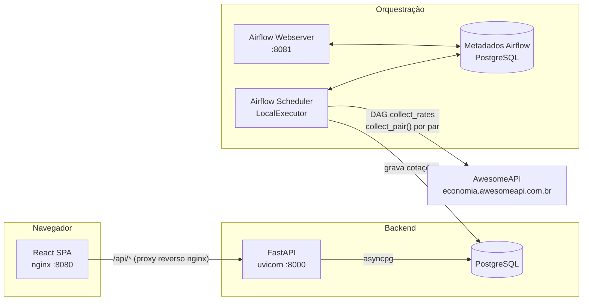

# Trillia Exchange Monitor

Monitor contínuo de cotações de câmbio (BRL, USD e outras moedas). O **Apache Airflow**
coleta a [AwesomeAPI](https://economia.awesomeapi.com.br) em intervalo configurável, o
histórico é persistido em **PostgreSQL** por trás de uma abstração de repositório, uma API
**FastAPI** expõe os dados e um **dashboard React** os visualiza em tempo quase real.

<p>
  
  
  
  
  
  
  
  
  
</p>

> Autor: **Matheus Rossi Carvalho** · Licença: MIT

---

## Sumário

- [Visão geral](#visão-geral)
- [Demo](#demo)
- [Stack](#stack)
- [Arquitetura](#arquitetura)
- [Pré-requisitos](#pré-requisitos)
- [Subir a stack completa](#subir-a-stack-completa)
- [API](#api)
- [Configuração](#configuração)
- [Testes e qualidade](#testes-e-qualidade)
- [Estrutura do projeto](#estrutura-do-projeto)
- [Diferenciais entregues](#diferenciais-entregues)
- [Licença](#licença)

## Visão geral

O serviço resolve o requisito central de **monitoramento contínuo de câmbio**:

1. O Airflow dispara o DAG `collect_rates` em intervalo configurável e, para cada par
   monitorado, executa a CLI do backend que busca a cotação e a grava no banco.
2. A gravação é **idempotente** — duplicatas do mesmo tick são descartadas, então o
   histórico cresce de forma consistente a cada coleta.
3. A API expõe a cotação mais recente (`/rates/latest`) e o histórico paginado
   (`/rates/history`), ambos exigidos pelo teste.
4. O dashboard React consome a API, monta **candlesticks (OHLC)** por timeframe e atualiza
   a cada 30s.

## Demo

Vídeo curto com a stack completa em execução: coleta orquestrada pelo Airflow, API FastAPI e
o dashboard de candlesticks atualizando em tempo quase real.

[](https://youtu.be/Z3HWFJzK0NM)

Link direto: https://youtu.be/Z3HWFJzK0NM

## Stack

| Camada | Tecnologias |
|---|---|
| **Backend** | Python 3.12, FastAPI, SQLAlchemy 2 (async) + asyncpg, Alembic, Pydantic v2, httpx + tenacity, structlog, Prometheus |
| **Orquestração** | Apache Airflow 2.10 (LocalExecutor) — DAG `collect_rates` |
| **Frontend** | React 19, Vite 8, TypeScript 6 (strict), Tailwind CSS + shadcn/ui, TanStack Query v5, Recharts 3, Zod 4 |
| **Infra** | Docker Compose (local), Terraform esquemático para AWS (ECS Fargate + RDS + ALB) |
| **Qualidade** | pytest (unit + integração via testcontainers), ruff, mypy (strict), Vitest + Testing Library + MSW, GitHub Actions |

## Arquitetura

A aplicação segue **Clean Architecture** no backend: o domínio não conhece SQLAlchemy nem
FastAPI; a persistência fica atrás da porta `RateRepository` e o provedor de cotações atrás
de `RateProvider`.



**Camadas do backend**

1. `domain/` — `CurrencyPair`, `ExchangeRate`, invariantes e erros tipados. Sem dependências externas.
2. `application/` — casos de uso (`CollectRateUseCase`, `GetLatestRateUseCase`,
   `GetRateHistoryUseCase`, `ListPairsUseCase`) e portas (`RateRepository`, `RateProvider`).
3. `infrastructure/` — app/routers FastAPI, repositório SQLAlchemy + mappers, cliente/provider
   AwesomeAPI (httpx + tenacity), helper `collect_pair` do Airflow e observabilidade.

**Fluxo de uma coleta**

1. O DAG `collect_rates` dispara; os pares vêm de `TRILLIA_MONITORED_PAIRS`.
2. Uma task mapeada roda por par → `collect_pair(par)` → `CollectRateUseCase.execute` →
   busca no provider (retry com backoff + jitter) → gravação no repositório
   (`ON CONFLICT DO NOTHING`).
3. A API lê do mesmo banco e serve `/rates/latest`, `/rates/history` e `/pairs`.

## Pré-requisitos

- **Docker Desktop** (Compose v2) — caminho recomendado.
- Para desenvolvimento local fora do Docker: **Python 3.12** e **Node 22**.

## Subir a stack completa

```bash
cp .env.example .env
docker compose up -d --build
```

| Serviço | URL |
|---|---|
| Dashboard (React) | http://localhost:8080 |
| API (FastAPI) | http://localhost:8000 |
| Documentação (Swagger) | http://localhost:8000/docs |
| Airflow UI | http://localhost:8081 (admin / admin) |

O DAG `collect_rates` sobe **despausado** e persiste cotações no intervalo definido em
`TRILLIA_POLLING_INTERVAL_SECONDS` (padrão 30s). O dashboard refaz o fetch a cada 30s.

```bash
docker compose down       # para a stack
docker compose down -v     # para e remove os volumes (zera o banco)
```

## API

| Método | Rota | Descrição |
|---|---|---|
| GET | `/rates/latest?pair=BRL-USD` | Cotação mais recente do par (404 se ainda não houver) |
| GET | `/rates/history?pair=&start_date=&end_date=&limit=&offset=` | Histórico paginado |
| GET | `/pairs` | Pares monitorados |
| GET | `/health` · `/ready` | Liveness / readiness |
| GET | `/metrics` | Exposição Prometheus |

Exemplo:

```bash
curl "http://localhost:8000/rates/latest?pair=BRL-USD"
curl "http://localhost:8000/rates/history?pair=BRL-USD&start_date=2026-06-01T00:00:00Z&end_date=2026-06-02T00:00:00Z&limit=100"
```

## Configuração

Tudo via variáveis de ambiente (ver [`.env.example`](.env.example)):

| Variável | Padrão | Descrição |
|---|---|---|
| `TRILLIA_DATABASE_URL` | `postgresql+asyncpg://trillia:trillia@db:5432/trillia` | URL do banco (async) |
| `TRILLIA_MONITORED_PAIRS` | `BRL-USD,BRL-EUR,...` | Pares monitorados (CSV) |
| `TRILLIA_POLLING_INTERVAL_SECONDS` | `30` | Intervalo de coleta do Airflow |
| `TRILLIA_AWESOMEAPI_BASE_URL` | `https://economia.awesomeapi.com.br` | Base do provider |
| `TRILLIA_PROVIDER_TIMEOUT_SECONDS` | `5` | Timeout do provider |
| `TRILLIA_PROVIDER_RETRY_ATTEMPTS` | `4` | Tentativas com backoff |
| `TRILLIA_LOG_LEVEL` / `TRILLIA_LOG_JSON` | `INFO` / `true` | Logging (structlog) |
| `VITE_API_BASE_URL` | `http://localhost:8000` | Base da API para o frontend |

## Testes e qualidade

```bash
# Backend
cd backend
pip install -e ".[dev]"
pytest                 # unit + integração (testcontainers sobe Postgres efêmero)
ruff check . && mypy .

# Frontend
cd frontend
npm ci
npm test               # Vitest + Testing Library + MSW
npm run lint && npm run typecheck
```

O pipeline de **CI** (GitHub Actions) roda backend, frontend, build Docker e validação do
Terraform a cada push/PR.

## Estrutura do projeto

```
.
├── backend/        # API FastAPI + Clean Architecture + CLI de coleta
├── frontend/       # SPA React (Vite + TypeScript)
├── airflow/        # Dockerfile + DAG collect_rates
├── terraform/      # IaC esquemático para AWS (não aplicado)
├── compose.yml     # Orquestração local (db, api, frontend, airflow)
└── .env.example
```

## Diferenciais entregues

Dashboard React (candlestick OHLC) · Docker Compose · múltiplos pares de moedas ·
Apache Airflow · Terraform esquemático (AWS) · métricas Prometheus · CI/CD (GitHub Actions) ·
vídeo de demonstração.

## Licença

Distribuído sob a licença **MIT**. © Matheus Rossi Carvalho.
