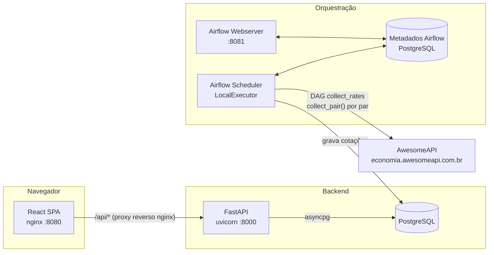

# Exchange Monitor

Monitor contínuo de cotações de câmbio (BRL, USD e outras moedas). O **Apache Airflow**
coleta a [AwesomeAPI](https://economia.awesomeapi.com.br) em intervalo configurável, o
histórico é persistido em **PostgreSQL** por trás de uma abstração de repositório, uma API
**FastAPI** expõe os dados e um **dashboard React** os visualiza em tempo quase real.

<p>
  
  
  
  
  
  
  
  
  
</p>

> Autor: **Matheus Rossi Carvalho** · Licença: MIT

---

## Sumário

- [Visão geral](#visão-geral)
- [Demo](#demo)
- [Stack](#stack)
- [Arquitetura](#arquitetura)
- [Pré-requisitos](#pré-requisitos)
- [Subir a stack completa](#subir-a-stack-completa)
- [API](#api)
- [Configuração](#configuração)
- [Pipeline Medallion](#pipeline-medallion)
- [Estrutura dos dados](#estrutura-dos-dados)
- [Consultas disponíveis](#consultas-disponíveis)
- [Indicadores produzidos](#indicadores-produzidos)
- [Testes e qualidade](#testes-e-qualidade)
- [Estrutura do projeto](#estrutura-do-projeto)
- [Limitações conhecidas](#limitações-conhecidas)
- [Remover recursos](#remover-recursos)
- [Diferenciais entregues](#diferenciais-entregues)
- [Licença](#licença)

## Visão geral

O serviço resolve o requisito central de **monitoramento contínuo de câmbio**:

1. O Airflow dispara o DAG `collect_rates` em intervalo configurável e, para cada par
   monitorado, executa a CLI do backend que busca a cotação e a grava no banco.
2. A gravação é **idempotente** — duplicatas do mesmo tick são descartadas, então o
   histórico cresce de forma consistente a cada coleta.
3. A API expõe a cotação mais recente (`/rates/latest`) e o histórico paginado
   (`/rates/history`), ambos exigidos pelo teste.
4. O dashboard React consome a API, monta **candlesticks (OHLC)** por timeframe e atualiza
   a cada 30s.
5. Um pipeline **Medallion** (Bronze → Silver → Gold), orquestrado pela DAG `build_medallion`,
   transforma o histórico cru em camadas tratadas (Parquet) via **DuckDB** e produz os
   indicadores analíticos.

## Demo

Vídeo curto com a stack completa em execução: coleta orquestrada pelo Airflow, API FastAPI e
o dashboard de candlesticks atualizando em tempo quase real.

[](https://youtu.be/Z3HWFJzK0NM)

Link direto: https://youtu.be/Z3HWFJzK0NM

## Stack

| Camada | Tecnologias |
|---|---|
| **Backend** | Python 3.12, FastAPI, SQLAlchemy 2 (async) + asyncpg, Alembic, Pydantic v2, httpx + tenacity, structlog, Prometheus |
| **Processamento** | DuckDB (SQL + Parquet) — camadas Silver/Gold da arquitetura Medallion |
| **Orquestração** | Apache Airflow 2.10 (LocalExecutor) — DAGs `collect_rates` e `build_medallion` |
| **Frontend** | React 19, Vite 8, TypeScript 6 (strict), Tailwind CSS + shadcn/ui, TanStack Query v5, Recharts 3, Zod 4 |
| **Infra** | Docker Compose (local), Terraform esquemático para AWS (ECS Fargate + RDS + ALB) |
| **Qualidade** | pytest (unit + integração via testcontainers), ruff, mypy (strict), Vitest + Testing Library + MSW, GitHub Actions |

## Arquitetura

A aplicação segue **Clean Architecture** no backend: o domínio não conhece SQLAlchemy nem
FastAPI; a persistência fica atrás da porta `RateRepository` e o provedor de cotações atrás
de `RateProvider`.


```mermaid
flowchart LR
  subgraph Navegador
    UI[React SPA<br/>nginx :8080]
  end

  subgraph Backend
    API[FastAPI<br/>uvicorn :8000]
    DB[(PostgreSQL)]
  end

  subgraph Orquestração
    SCH[Airflow Scheduler<br/>LocalExecutor]
    WEB[Airflow Webserver<br/>:8081]
    ADB[(Metadados Airflow<br/>PostgreSQL)]
  end

  EXT[AwesomeAPI<br/>economia.awesomeapi.com.br]

  UI -- "/api/* (proxy reverso nginx)" --> API
  API -- asyncpg --> DB
  SCH -- "DAG collect_rates<br/>collect_pair() por par" --> EXT
  SCH -- grava cotações --> DB
  SCH <--> ADB
  WEB <--> ADB
```

**Camadas do backend**

1. `domain/` — `CurrencyPair`, `ExchangeRate`, invariantes e erros tipados. Sem dependências externas.
2. `application/` — casos de uso (`CollectRateUseCase`, `GetLatestRateUseCase`,
   `GetRateHistoryUseCase`, `ListPairsUseCase`) e portas (`RateRepository`, `RateProvider`).
3. `infrastructure/` — app/routers FastAPI, repositório SQLAlchemy + mappers, cliente/provider
   AwesomeAPI (httpx + tenacity), helper `collect_pair` do Airflow e observabilidade.

**Fluxo de uma coleta**

1. O DAG `collect_rates` dispara; os pares vêm de `EXCHANGE_MONITORED_PAIRS`.
2. Uma task mapeada roda por par → `collect_pair(par)` → `CollectRateUseCase.execute` →
   busca no provider (retry com backoff + jitter) → gravação no repositório
   (`ON CONFLICT DO NOTHING`).
3. A API lê do mesmo banco e serve `/rates/latest`, `/rates/history` e `/pairs`.

## Pré-requisitos

- **Docker Desktop** (Compose v2) — caminho recomendado.
- Para desenvolvimento local fora do Docker: **Python 3.12** e **Node 22**.

## Subir a stack completa

```bash
cp .env.example .env
docker compose up -d --build
```

| Serviço | URL |
|---|---|
| Dashboard (React) | http://localhost:8080 |
| API (FastAPI) | http://localhost:8000 |
| Documentação (Swagger) | http://localhost:8000/docs |
| Airflow UI | http://localhost:8081 (admin / admin) |

O DAG `collect_rates` sobe **despausado** e persiste cotações no intervalo definido em
`EXCHANGE_POLLING_INTERVAL_SECONDS` (padrão 30s). O dashboard refaz o fetch a cada 30s.

```bash
docker compose down       # para a stack
docker compose down -v     # para e remove os volumes (zera o banco)
```

## API

| Método | Rota | Descrição |
|---|---|---|
| GET | `/rates/latest?pair=BRL-USD` | Cotação mais recente do par (404 se ainda não houver) |
| GET | `/rates/history?pair=&start_date=&end_date=&limit=&offset=` | Histórico paginado |
| GET | `/pairs` | Pares monitorados |
| GET | `/health` · `/ready` | Liveness / readiness |
| GET | `/metrics` | Exposição Prometheus |

Exemplo:

```bash
curl "http://localhost:8000/rates/latest?pair=BRL-USD"
curl "http://localhost:8000/rates/history?pair=BRL-USD&start_date=2026-06-01T00:00:00Z&end_date=2026-06-02T00:00:00Z&limit=100"
```

## Configuração

Tudo via variáveis de ambiente (ver [`.env.example`](.env.example)):

| Variável | Padrão | Descrição |
|---|---|---|
| `EXCHANGE_DATABASE_URL` | `postgresql+asyncpg://exchange:exchange@db:5432/exchange` | URL do banco (async) |
| `EXCHANGE_MONITORED_PAIRS` | `BRL-USD,BRL-EUR,...` | Pares monitorados (CSV) |
| `EXCHANGE_POLLING_INTERVAL_SECONDS` | `30` | Intervalo de coleta do Airflow |
| `EXCHANGE_AWESOMEAPI_BASE_URL` | `https://economia.awesomeapi.com.br` | Base do provider |
| `EXCHANGE_PROVIDER_TIMEOUT_SECONDS` | `5` | Timeout do provider |
| `EXCHANGE_PROVIDER_RETRY_ATTEMPTS` | `4` | Tentativas com backoff |
| `EXCHANGE_LOG_LEVEL` / `EXCHANGE_LOG_JSON` | `INFO` / `true` | Logging (structlog) |
| `VITE_API_BASE_URL` | `http://localhost:8000` | Base da API para o frontend |

## Pipeline Medallion

Além da coleta contínua, um pipeline batch/micro-batch transforma o histórico cru em camadas
tratadas seguindo a arquitetura **Medallion**. A DAG `build_medallion` (Airflow) encadeia as
etapas com dependência real — `build_silver → build_gold → validate_gold` — de modo que uma
etapa nunca roda antes da anterior concluir. As mesmas etapas podem ser executadas manualmente:

```bash
docker compose run --rm api build-silver     # Bronze → Silver (Parquet)
docker compose run --rm api build-gold       # Silver → Gold  (Parquet)
docker compose run --rm api validate-gold    # valida a camada Gold e loga o relatório
```

O processamento usa **DuckDB**: lê a camada Bronze (tabela `exchange_rates`), grava Parquet
particionado nas camadas tratadas e agrega os indicadores.

## Estrutura dos dados

| Camada | Local | Conteúdo |
|---|---|---|
| **Bronze** | tabela `exchange_rates` + `data/bronze/<par>/<data>.jsonl` | ticks crus (payload original, sem transformação) |
| **Silver** | `data/silver/silver.parquet` | limpo, tipado, UTC, com `mid` e `spread`; inválidos descartados |
| **Gold** | `data/gold/gold_daily.parquet`, `gold_hourly.parquet` | indicadores por par/dia e eventos por par/hora |

**Esquema Bronze (`exchange_rates`):** `pair`, `bid`, `ask`, `fetched_at`, `provider_timestamp`,
`provider_name`.
**Silver:** acrescenta `mid = (bid+ask)/2`, `spread = ask−bid`, `day`, `hour`.
**Gold (diário):** `pair`, `day`, `open`, `close`, `high`, `low`, `avg_mid`, `volatility`,
`avg_spread`, `variation_pct`, `tick_count`.

## Consultas disponíveis

Três consultas analíticas (DuckDB) sobre a camada Gold, em [`queries/`](queries/):

| Arquivo | Consulta |
|---|---|
| `queries/q1_variacao_diaria.sql` | Variação percentual diária por par |
| `queries/q2_ranking_volatilidade.sql` | Ranking de pares mais voláteis (desvio-padrão do `mid`) |
| `queries/q3_spread_min_max.sql` | Spread médio e faixa (min/max do `mid`) por par/dia |

```bash
# Ex.: substitua DAILY_PARQUET pelo caminho do gold_daily.parquet e rode no DuckDB
duckdb -c ".read queries/q1_variacao_diaria.sql"
```

## Indicadores produzidos

- **Spread médio** (`ask − bid`);
- **Volatilidade diária** (desvio-padrão do `mid`);
- **Variação percentual diária** (`(close − open) / open`);
- **Mínimo/máximo do `mid`** e faixa do dia (`high − low`);
- **OHLC** por par/dia;
- **Eventos por hora** (contagem de coletas por par/hora);
- **Percentual de registros inválidos** (qualidade dos dados).

## Testes e qualidade

```bash
# Backend
cd backend
pip install -e ".[dev]"
pytest                 # unit + integração (testcontainers sobe Postgres efêmero)
ruff check . && mypy .

# Frontend
cd frontend
npm ci
npm test               # Vitest + Testing Library + MSW
npm run lint && npm run typecheck
```

O pipeline de **CI** (GitHub Actions) roda backend, frontend, build Docker e validação do
Terraform a cada push/PR.

## Estrutura do projeto

```
.
├── backend/        # API FastAPI + Clean Architecture + CLI (coleta + Medallion)
├── frontend/       # SPA React (Vite + TypeScript)
├── airflow/        # Dockerfile + DAGs collect_rates e build_medallion
├── processing/     # SQL DuckDB das camadas Silver e Gold
├── queries/        # consultas analíticas sobre a camada Gold
├── data/           # bronze/ silver/ gold/ (runtime) e sample/ (amostra versionada)
├── entregas/       # documentos e evidências da atividade
├── terraform/      # IaC esquemático para AWS (não aplicado)
├── compose.yml     # Orquestração local (db, api, frontend, airflow)
└── .env.example
```

## Limitações conhecidas

- Pipeline **batch/micro-batch** (coleta a cada 30s, camadas a cada 5 min) — não é streaming
  em tempo real.
- Camada Gold servida via **Parquet + consultas DuckDB**; não há data warehouse dedicado nem
  endpoint de indicadores exposto pela API (caminho opcional não habilitado nesta versão).
- Ambiente **local** (Docker Compose). O Terraform para AWS é esquemático e não é aplicado.
- A extensão `postgres` do DuckDB é baixada na primeira execução — o host precisa de acesso à
  internet para o primeiro `build-silver`.

## Remover recursos

```bash
docker compose down -v            # para a stack e remove os volumes (zera o banco)
rm -rf data/silver data/gold      # remove os Parquet gerados em runtime (opcional)
cd terraform && terraform destroy  # apenas se algum recurso AWS tiver sido aplicado
```

## Diferenciais entregues

Pipeline Medallion (Bronze/Silver/Gold) com DuckDB + Parquet · dashboard React (candlestick
OHLC) · Docker Compose · múltiplos pares de moedas · Apache Airflow (coleta + build_medallion) ·
Terraform esquemático (AWS) · métricas Prometheus · CI/CD (GitHub Actions) · vídeo de
demonstração.

## Licença

Distribuído sob a licença **MIT**. © Matheus Rossi Carvalho.
