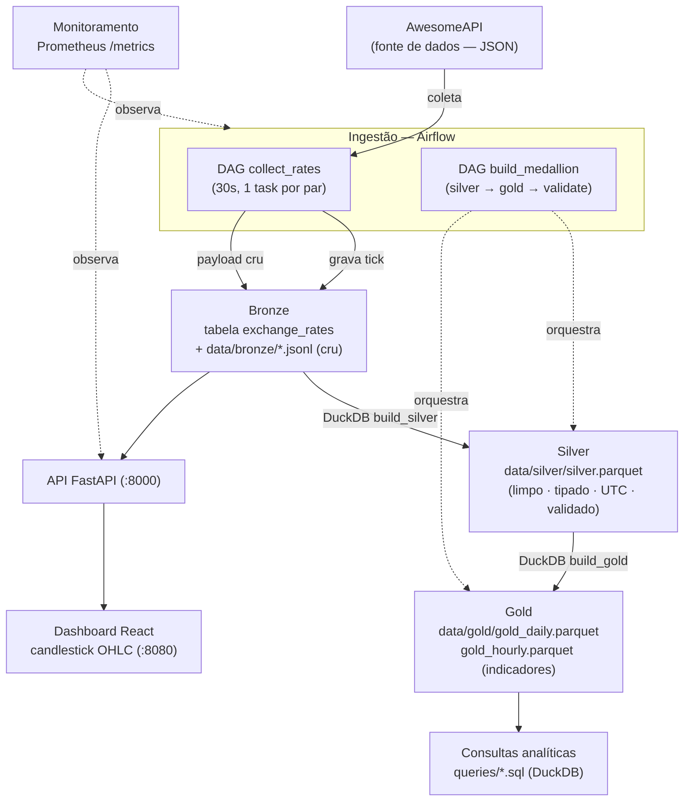

# Entrega 2 — Diagrama de Arquitetura

O diagrama abaixo mostra o fluxo completo dos dados: fonte, ingestão, armazenamento em
camadas (Bronze/Silver/Gold), processamento, orquestração, consulta, visualização e
monitoramento. As setas indicam o sentido do fluxo dos dados.

## Legenda do fluxo

1. **Fonte:** AwesomeAPI fornece cotações em JSON por par.
2. **Ingestão:** a DAG `collect_rates` coleta a cada 30s (uma task por par) e grava o tick no
   Postgres, além de registrar o payload cru em `data/bronze/`.
3. **Bronze:** dado original, sem transformação (tabela `exchange_rates` + JSONL).
4. **Silver:** DuckDB limpa, tipa, normaliza para UTC, calcula `mid`/`spread`, valida e grava
   Parquet.
5. **Gold:** DuckDB agrega por par/dia e por par/hora, produzindo os indicadores em Parquet.
6. **Orquestração:** a DAG `build_medallion` encadeia Silver → Gold → validação, garantindo
   que uma etapa dependente não execute antes da conclusão da anterior.
7. **Consulta e visualização:** as queries em `queries/` leem a camada Gold; o dashboard React
   consome a API e exibe candlesticks OHLC.
8. **Monitoramento:** o Prometheus coleta métricas (`/metrics`) da API e do pipeline.
