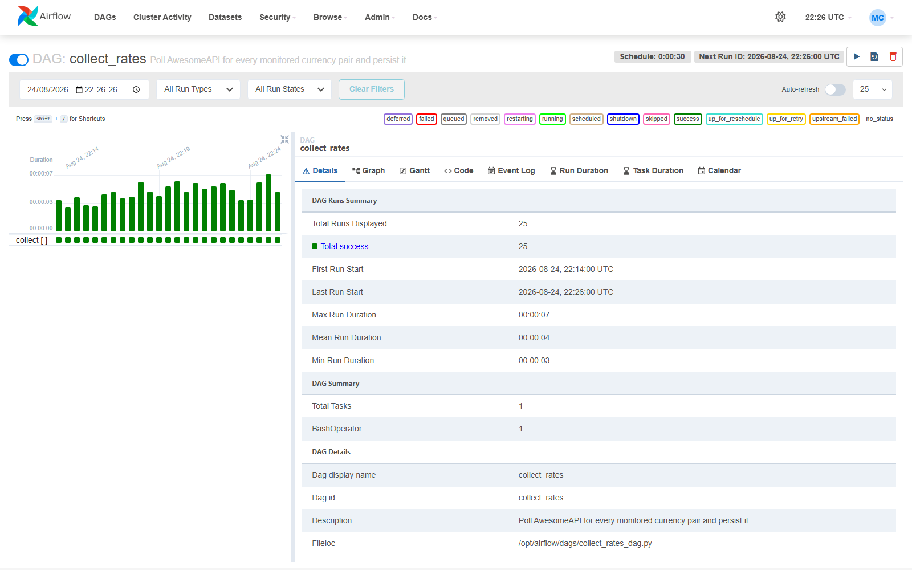
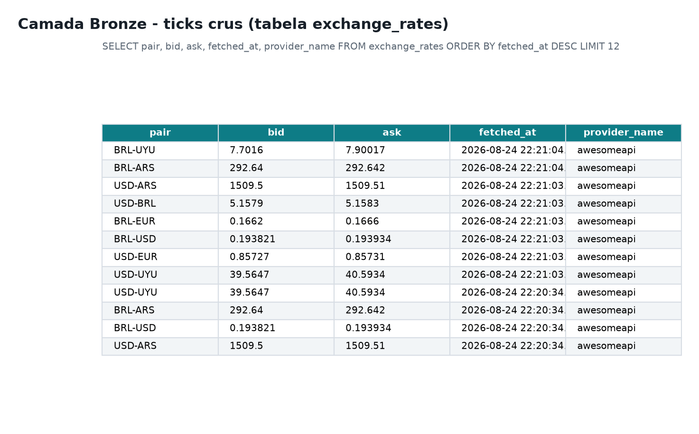
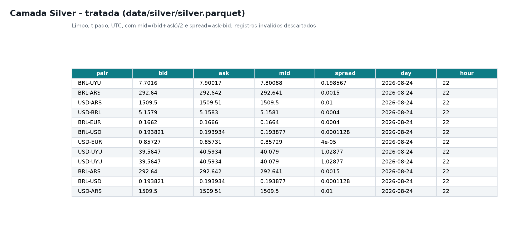
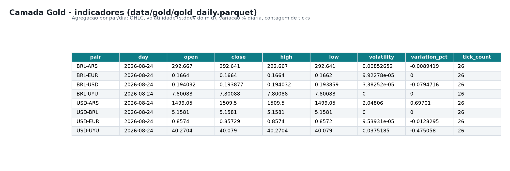
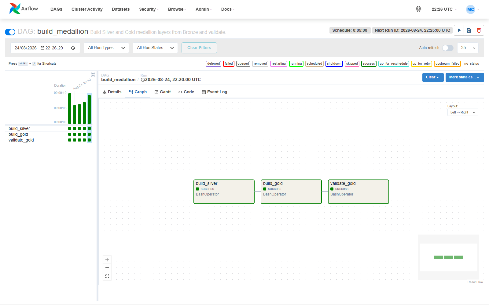
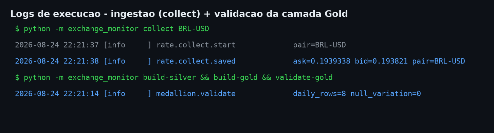
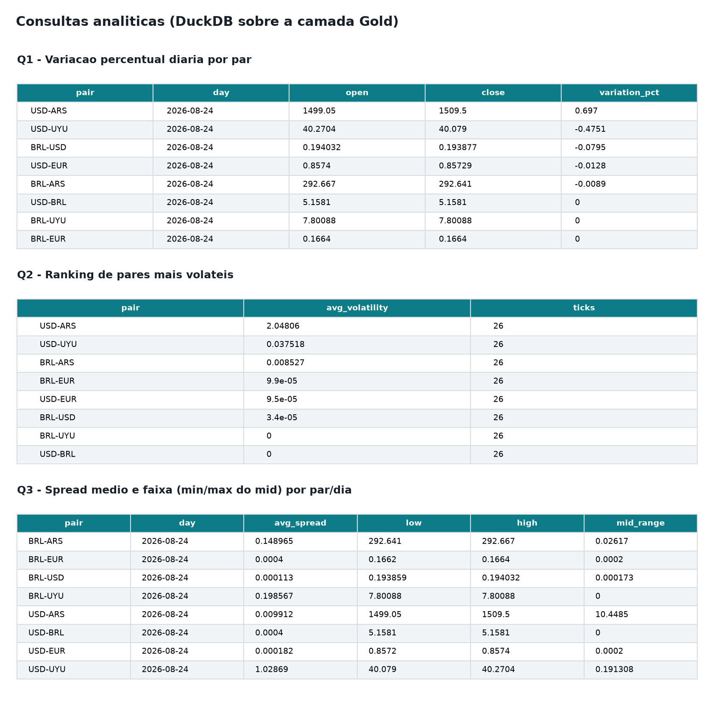
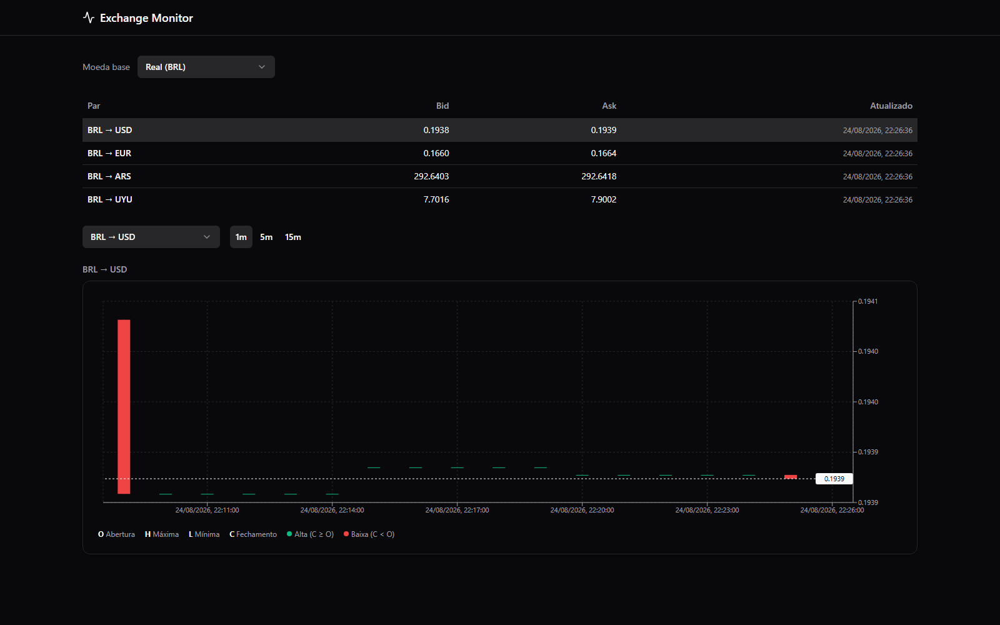

# Entrega 6 — Evidências de Execução

Evidências capturadas após subir a stack (`docker compose up -d --build`) e executar as DAGs
de coleta e de construção das camadas. Cada seção corresponde a um requisito da atividade.

> As imagens ficam em `entregas/assets/`. Substitua os arquivos indicados pelos prints reais
> da sua execução (mantendo os nomes) para completar esta entrega.

## 1. Ingestão — DAG `collect_rates` (Airflow)

Coleta agendada a cada 30s, uma task por par, gravando no Postgres e no Bronze cru.



## 2. Bronze — dado cru

Registros na tabela `exchange_rates` e/ou arquivos `data/bronze/<par>/<data>.jsonl`.



## 3. Silver — dado tratado (Parquet)

`data/silver/silver.parquet` com `mid`, `spread`, tipos e timezone normalizados; registros
inválidos descartados.



## 4. Gold — indicadores (Parquet)

`data/gold/gold_daily.parquet` (OHLC, volatilidade, variação %, spread médio) e
`gold_hourly.parquet` (eventos/hora).



## 5. Orquestração — DAG `build_medallion`

Grafo de tarefas dependentes: `build_silver → build_gold → validate_gold`.



## 6. Logs de execução

Logs estruturados (structlog) da coleta e da validação da camada Gold
(`medallion.validate` com `daily_rows` e `null_variation`).



## 7. Consultas analíticas

Saída das três queries (`queries/q1_variacao_diaria.sql`, `q2_ranking_volatilidade.sql`,
`q3_spread_min_max.sql`) executadas via DuckDB sobre a camada Gold.



## 8. Dashboard

Dashboard React exibindo candlesticks OHLC por par e timeframe, atualizando em tempo
quase real.



---

## Como reproduzir as evidências

```bash
# 1. Subir a stack
docker compose up -d --build

# 2. Aguardar algumas coletas do DAG collect_rates (Airflow UI: http://localhost:8081)

# 3. Construir e validar as camadas manualmente (ou aguardar o DAG build_medallion)
docker compose run --rm api build-silver
docker compose run --rm api build-gold
docker compose run --rm api validate-gold

# 4. Rodar as consultas analíticas sobre a camada Gold
duckdb -c ".read queries/q1_variacao_diaria.sql"   # após substituir DAILY_PARQUET pelo caminho real
```
